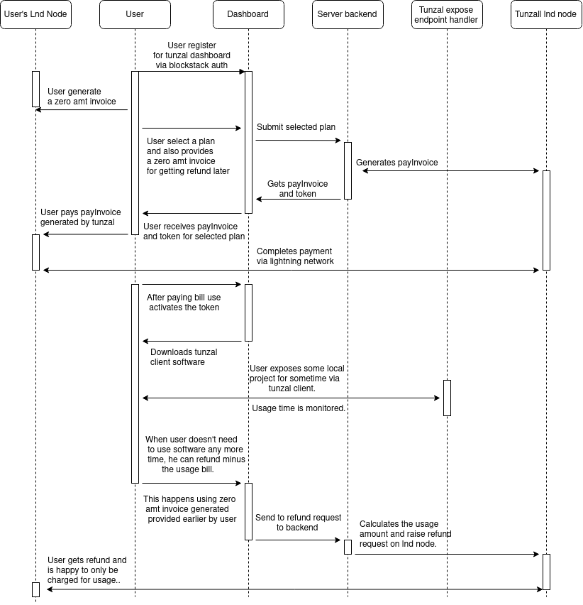

## Tunzal

Tunzal is a tunneling solution to expose local endpoint outside of the private network. User can use subdomains of tunzal.ml as their public endpoint. The request coming to the public endpoint will be reverse proxied to local services running on their system. This service is similar to ngrok or agro from Cloudflare. Here, we enable users to use their desired subdomain for a premium fee. The premium feature is available for a cost on hr, day, month or year basis.

Here we have tried to move from `subscription-based model` to `usage-based model`, by allowing the users to get refunded if they like to discontinue the service or they no longer need it. This is enabled by using the lightning network and its unique feature of enabling micropayment. Currently, in the lightning network, if we want to send the payment to the recipient then firstly recipient has to generate the invoice with the amount specified. Apart from cost specified invoices, the lightning network allows one to generate `zero amount invoice`. Using zero amount invoice, one can send any amount to the recipient. We have used this to implement a refund mechanism in our service. While generating a secret token for our service, users can specify the zero amount invoice. So, when the user raises the request for a refund, the bitcoin will be transferred back to the user via this invoice. The amount for refund is determined by subtracting usage time in minutes from the total amount(in satoshis) paid for service.

Now for an example:
if the user purchases `plan A` for 1 hr with 60 satoshis. If he uses our service for 20 minutes and raises the request within 60 minutes time frame then he is refunded 40 satoshis. Though if he misses this time frame, no refund is provided. This is because, when generating an invoice,  expiration time must be specified. As a result, when generating the zero amount invoice(ZCI) if the user-specified 60*60 seconds then that invoice is only valid for one hr. So, here we assume the expiration of ZCI to be equal to the selected `PLAN` duration.

### Implementation details
- For lightning network node, we are using `lnd` implementation from lightninglabs.
- Neutrino client for connecting with blockchain layer.
- For generating the subdomains of tunzal.ml we are using DNS zone of azure nameservers.
- The backend API server is connected to mongo for token storage, and execs grpc on the lnd.

- Authentication to the dashboard is via blockstack OAuth.
- Generating token, buying a plan, activating token and getting refunded is done via the dashboard.
- Once a token is activated, the user can download the tunzal client software from our website. And run client software as shown below:
`inlets client --upstream node1.tunza.ml=<local-endpoint> -t <api-token>`
- After usage, a refund request can be raised on dashboard.

### Idea
While getting started with lightning network, I got to know about custodial wallets but they lacked features and involved trusting third party. I looked into BTCPayServer but they didn't allow generating lightning invoice for third party merchants. On telegram @t.me/btcpayserver, roughdust61F helped me understand lightning network and different ways of generating the invoices. He also introduced me to opennode. Around this time, I got to know about sphinx PR in lnd implementaton. Sphinx feature enabled sending payment without generating invoice, this is one step closer in direction of lightning network's adoption as micropayment processing solution.

I decided to self host lnd server for getting access to all the experimental features including sphinx. While setting up lnd nodes, I got help from lightninglabs slack. There @moli cleared my doubts and updated me on the current progress of lnd and completed BOLTs. I got to know Sphinx is more of a PR than an actual feature and suggested looking at suredbits for getting idea of how time based payment works. I wanted to learn more about local endpoint tunnel solution and I also found a article on zero amount invoices. So, I combine these ideas with usage-based business model.

The dashboard is available at https://tunzal.ml.

### Challenges faced
- A lot of learning. I have been involved with blockchain for past one year. But Bitcoin was a new domain for me.
- Setting up lnd, BTCPayServer and working with macaroons.
- Blockstack  CORS error.
- Testing experimental features of lightning network.

### References
- https://material-ui.com/getting-started/installation/
- https://docs.microsoft.com/en-us/azure/dns/dns-web-sites-custom-domain
- https://docs.microsoft.com/en-us/azure/dns/dns-getstarted-cli
- https://dev.lightning.community/tutorial/
- https://github.com/lightningnetwork/lnd/
- https://bitcoinfaucet.uo1.net/
- https://zocada.com/setting-mongodb-users-beginners-guide/